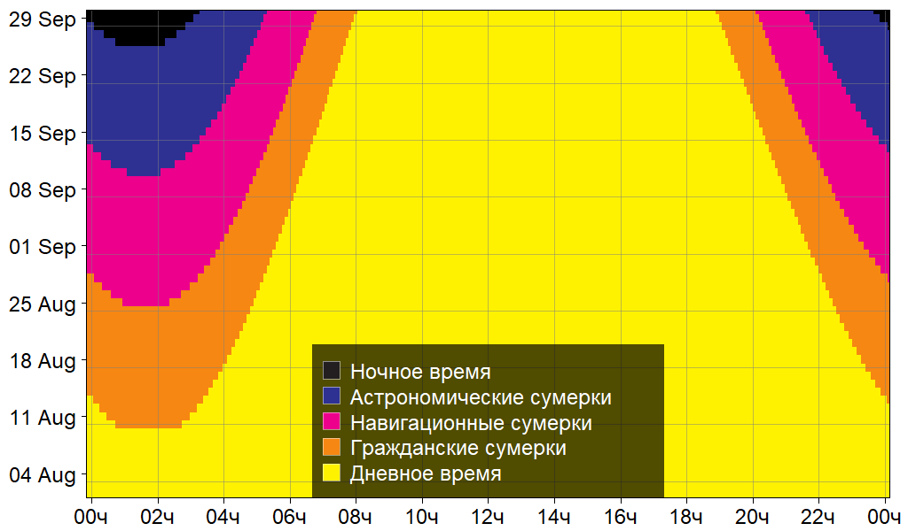

```{r}
showModal(modalDialog(title="Погода на Таймыре"
                     ,"Анализ погодных условия на метеостанциях Таймыра"
                     ,size="s",easyClose=T,footer=NULL))
```

```{r resources, eval=T, code=readLines("resources.R")}
```

```{r client, eval=T, code=readLines("client.R")}
```

```{r server, eval=T, code=readLines("server.R")}
```

```{r init,include=FALSE}
ursa:::.gc(TRUE)
advanced <- TRUE
# plutil::pluglibrary("thematic")
# thematic::thematic_rmd(font = "auto")
```

# Sidebar {.sidebar data-width="150px"}

```{r}
selectInput("month","Сезон"
           ,choices=c('Не выбрано'="none",seasonLUT())
           ,selected=list('empty'=""
                         ,'spring'=seasonLUT()[4:5]
                         ,'autumn'=seasonLUT()[8:9]
                         ,'winter'=seasonLUT()[c(11,2)]
                         )[['autumn']]
                         ,multiple=TRUE)
selectInput("station","Метеостанция"
           ,choices=c('Не выбрано'="",stationLUT())
           ,selected=stationLUT()[grep("Диксон",names(stationLUT()),ignore.case=TRUE)]
           ,multiple=TRUE)
selectInput("year","Годы для анализа"
           ,choices=c('Не выбрано'="")
           ,selected="",multiple=TRUE)
# selectInput("year","Годы для анализа",selected="2023",choices=c("2023","2022","2021"),multiple=F)
# sliderInput("span",label="Сглаживание",min=0,max=1,step=0.01,value=0)
checkboxInput("draw","Отрисовка",value=!TRUE)
```

```{r eval=staffOnly}
verbatimTextOutput("verbose2")
output$verbose2 <- renderPrint({
   print(count)
   verb <- list(station=input[["station"]],year=input[["year"]]
               ,season=input[["month"]],span=input[["span"]])
   str(verb)
})
```

---


```{r eval=staffOnly}
textOutput("verbose3")
output$verbose3 <- renderText({
   paste("flexdashboard:",as.character(packageVersion("flexdashboard"))
        ,"\n\n","ursa:",as.character(packageVersion("ursa")))
})
```

# Основное {#primary}

##

### {data-header="panel 1"}

```{r, eval=T}
wmo_select_and_plot("prm1","VV")
```

### {data-header="panel 2"}

```{r, eval=T}
wmo_select_and_plot("prm2","Ff")
```

##

### {data-header="panel 3"}


```{r, eval=T}
wmo_select_and_plot("prm3","WW")
```

### {data-header="panel 4"}

```{r, eval=T}
wmo_select_and_plot("prm4","H")
```

# Дополнительное {#secondary}

## {data-info="column 1" data-width=100}

### {data-info="column 1, row 1"}

```{r, eval=FALSE}
leaflet::renderLeaflet({
   station <- station0[station0$wmo %in% as.integer(input[["station"]]),]
   req(spatial_count(station)>0)
   m <- mapview::mapview(station)@map
   m
})

```{r, eval=advanced}
imageOutput("stationMap")
output$stationMap <- renderImage({
   uiStationMap("stationMap")
},deleteFile=TRUE)
```

### {data-info="column 1, row 2"}

```{r, eval=staffOnly}
verbatimTextOutput("verbose")
output$verbose <- renderPrint({
   ursa:::.gc(TRUE)
})
```

### {data-info="column 1, row 3"}

```{r eval=advanced}
renderImage({
   cat("render Sunset:\n")
   req(stationLUT()["о. Диксон"] %in% input[["station"]])
   ret <- 
   list(src=ret
       ,'height'="auto"
       ,'width'="90%"
      # ,'max-height'="100%"
      # ,'max-width'="90%"
      # ,'flex'="0 0 auto"
       ,'object-fit'="contain"
      # ,'max-inline-size'="100%"
      # ,'block-size'="auto"
      # ,'display'="block"
       )
},deleteFile=FALSE)
```

## {data-info="column 2" data-width=160}

### {data-info="column 2, row 1"}

```{r, eval=FALSE}
renderImage({
   station <- station0[station0$wmo %in% as.integer(input[["station"]]),]
   req(spatial_count(station)>0)
  # station <- spatialize(station,style="web",resetGrid=TRUE)
   ret <- display(pixelsize())
   list(src=ret,'width'="auto",'height'="100%",'max-height'="100%"
       ,'object-fit'="scale-down",class="propersize") #,display="inline-block")
},deleteFile=TRUE)
```

### {data-info="column 2, row 2"}

```{r windrose, eval=advanced}
renderPlot({
   req(input[["draw"]])
   req(rvStationSelected())
   req(rvYearSelected())
   req(rvSeasonSelected())
   plot_windrose(rvWMO()
                  ,station=rvStationSelected()
                  ,year=rvYearSelected()
                  ,season=rvSeasonSelected()
                  )
})
```

## {data-info="column 3" data-width=80}

###

```{r}
removeModal()
```
